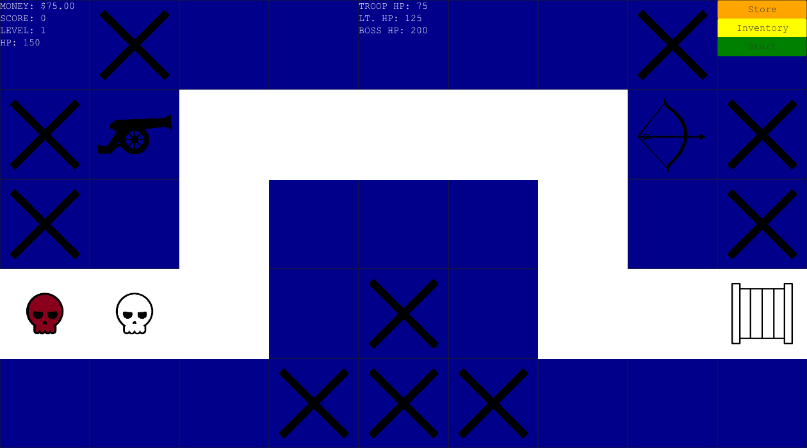

# Save Judy · Tower Defense

A JavaFX desktop tower defense game built as a **2021 Georgia Tech CS 2340 team class project**. Buy and place towers, defend Judy's monument, and survive a final boss encounter.

The original project name, **Judy**, remains in the Java packages. This repository preserves the team's coursework while making it easier to build, play, and understand.



## Run locally

Use **JDK 11 or newer** and a desktop environment. The project targets Java 11 and uses **JavaFX 17.0.20**, which [supports JDK 11](https://gluonhq.com/products/javafx/). The included [Maven Wrapper](https://maven.apache.org/tools/wrapper/) downloads Maven on first use; Maven downloads the JavaFX dependencies, so a separate JavaFX SDK is unnecessary. See the [OpenJFX Maven guide](https://openjfx.io/openjfx-docs/#maven) for background.

1. Clone the repository:

   ```bash
   git clone https://github.com/vig-star/TowerDefenseGame.git
   cd TowerDefenseGame
   ```

2. Check the Java version selected by Maven:

   ```bash
   ./mvnw --version
   ```

3. Launch the game:

   ```bash
   ./mvnw javafx:run
   ```

On Windows PowerShell, replace `./mvnw` with `.\mvnw.cmd`. In IntelliJ IDEA, open `pom.xml` as a Maven project, select JDK 11, and run the Maven `javafx:run` goal.

The window is designed for **1260 × 700** pixels. This is a desktop application; it does not run through GitHub Pages. Use a JDK matching your machine's architecture so Maven selects the appropriate JavaFX native libraries.

## How to play

1. Click **START** on the welcome screen. Type your name, click **Enter**, choose **Easy**, **Medium**, or **Hard**, then click **Start**.
2. Open **Store**, choose a cannon, crossbow, or tank, and confirm the purchase. Each difficulty sets its own budget and prices.
3. Open **Inventory**, select a purchased tower, then click an empty blue tile to place it. White path tiles and tiles marked **X** cannot hold towers.
4. Click **Start** on the board to release the basic and strong enemies. Towers attack automatically. Click a placed tower to buy a damage upgrade when you can afford it.
5. After both enemies are defeated, click **Start** again to release the boss. Defeat it to win; losing all monument health ends the game. The result screen shows your score and damage totals and offers **RESTART**.

| Tower | Implemented attack range |
| --- | --- |
| Cannon | Enemies in the same row or column |
| Crossbow | Enemies in the same row or column, with a different damage value |
| Tank | Enemies within two rows and two columns of its tile |

Upgrades cost **60% of the tower's purchase price** and add **5** to its internal damage value. Combat applies a difficulty multiplier. Some original store descriptions do not match these runtime values; the implementation is explained in [How the game works](docs/ARCHITECTURE.md).

## JavaFX and class-project context

The project practices object-oriented Java, event-driven interfaces, FXML layouts, shared game state, and GUI testing. The commit history spans September–December 2021 and records work from multiple contributors. The course Checkstyle script and milestone testing deliverables remain in the repository.

JavaFX supplies the application window, scenes, controls, images, and UI thread. **FXML** defines screen layouts; **controllers** respond to button clicks; **model classes** represent the player, towers, enemies, and monument. This is a controller-driven student implementation: combat logic lives largely in `InitialGameScreenController`, and some model classes also hold JavaFX nodes.

| Code | Responsibility |
| --- | --- |
| [`TowerDefenseApplication`](src/main/java/com/example/judy/TowerDefenseApplication.java) and [`screens/`](src/main/resources/com/example/judy/screens/) | Launch the JavaFX application and define its FXML screens |
| [`controllers/`](src/main/java/com/example/judy/controllers/) | Handle setup, navigation, purchases, placement, combat, and results |
| [`Game`](src/main/java/com/example/judy/modules/Game.java) and [`GameAdmin`](src/main/java/com/example/judy/modules/GameAdmin.java) | Store a run's state and share the active game across controllers |
| [`modules/`](src/main/java/com/example/judy/modules/) | Define `Player`, `Monument`, `Tile`, and the `Tower` and `Enemy` class hierarchies |
| [`src/test/`](src/test/) | Preserve the original JUnit 4/TestFX GUI tests |

See [How the game works](docs/ARCHITECTURE.md) for screen transitions, the combat loop, difficulty settings, and implementation boundaries.

## Design patterns and principles

- **MVC-inspired organization:** FXML defines views, controllers handle user actions, and game classes hold state. The separation is partial because the main controller also runs combat and some models hold JavaFX controls.
- **Event-driven callbacks:** JavaFX connects clicks to FXML handlers and `setOnAction` callbacks. This is Observer-style event handling supplied by the framework; the game's status labels use polling rather than model observers.
- **Shared game-state access:** `GameAdmin` exposes one static current-game reference to the controllers. It is a global state holder, not a conventional Singleton with a private constructor and `getInstance()`.
- **Abstraction, inheritance, and encapsulation:** abstract `Tower` and `Enemy` classes share state across concrete types; private fields and accessors organize state. Combat still checks concrete types, and mutable collections remain exposed.
- **Separation of concerns and SOLID tradeoffs:** small model classes have focused roles, while the main controller combines many responsibilities. Adding a tower requires edits in several places, so the design only partly follows the Single Responsibility and Open/Closed principles.

Read [Design patterns and principles](docs/DESIGN.md) for concrete code examples, benefits, limitations, and an explanation suitable for discussing the class project.

## Build and validate

Compile the application and all test sources, then package the project:

```bash
./mvnw clean verify
```

**GUI tests are opt-in** because they need a display and drive real JavaFX controls. The default build compiles them but skips execution. The packaged JAR is not a standalone JavaFX installer; use `javafx:run` to play.

Run the interface smoke tests on a desktop:

```bash
./mvnw -Pgui-tests -Dtest=WelcomeScreenTest,InitialConfigScreenTest,InitialGameScreenTest,TowerMenuTest test
```

Run all **46 GUI tests**:

```bash
./mvnw -Pgui-tests test
```

Allow roughly **8–12 minutes** for the full suite: the original combat tests contain over six minutes of fixed waits. Tests control the mouse and keyboard, so leave the game window undisturbed. Timing and shared state can affect results. Reports are written to `target/surefire-reports/`.

GitHub Actions builds the project and runs the selected interface smoke tests under a virtual Linux display. Full combat coverage is a separate check; the workflow's manual run also offers the full suite.

To reproduce the README screenshot on macOS or Linux, run `./scripts/capture-gameplay.sh`. This separate smoke helper opens the game, invokes its UI handlers, verifies setup, purchases, placement, and combat damage, then saves `docs/images/gameplay.png` and exits. It needs a display but does not control the mouse or capture the desktop.

## Scope and project history

This is a small coursework game with one fixed board, two combat levels, and in-memory sessions. It has no save system, map editor, or multiplayer. The original threading and shared-state design has known limitations, including brief UI pauses and background tasks that can outlive screens. See the [implementation notes](docs/ARCHITECTURE.md#implementation-boundaries).

The original project used JavaFX 11.0.2. GitHub preparation updates the runtime to JavaFX 17.0.20 after reproducing a native startup crash with the older version on the current macOS environment. The Java 11 source target and original game implementation are preserved.

The original [`M4`, `M5`, and `M6` testing deliverables](src/main/resources/com/example/judy/assets/testing-deliverables/) and [`CS 2340 Checkstyle configuration`](cs2340_checks.xml) document the coursework process. The legacy `run_checkstyle.py` helper is retained as course material and is not part of the Maven build.

Credit belongs to the original team; see the [contributor history](https://github.com/vig-star/TowerDefenseGame/graphs/contributors) for attribution. The repository does not declare a project license or separate asset licenses.
